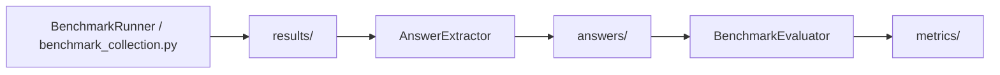

# Personas Prompting in Factual Knowledge Tasks

This workspace hosts a benchmark pipeline for running language models, collecting raw outputs, normalizing answers, and computing evaluation metrics across multiple 'Factual Knowledge' datasets.
The main objective is to develop a broad analysis of the effects of Personas Prompt on the LLMs when running this specific set of tasks.

The project is organized around a small set of core classes and helpers:

- `LLM` provides the unified model interface.
- `BenchmarkRunner` builds prompts, injects personas, and runs benchmarks.
- `BenchmarkEvaluator`, `AnswerExtractor`, `AccuracyComputer`, and `ConfidenceComputer` normalize raw outputs and compute metrics.
- `benchmark_collection.py` stores raw benchmark runs in a consistent results layout.

## End-to-End Pipeline

The main data flow is:

1. `results/` stores raw benchmark runs generated by `BenchmarkRunner` and collected by `benchmark_collection.py`.
2. `answers/` stores normalized answer artifacts derived from those raw results.
3. `metrics/` stores accuracy and confidence summaries computed from the answer artifacts.

In practice, the pipeline uses these references:

- `BenchmarkRunner.run_benchmark()` executes a benchmark configuration and returns the raw per-question results.
- `benchmark_collection.py` writes those raw runs into `results/<benchmark>/<model_id>/...json`.
- `AnswerExtractor.extract()` normalizes each model output into a comparable answer form.
- `BenchmarkEvaluator.evaluate_results()` combines `AnswerExtractor`, `AccuracyComputer`, and `ConfidenceComputer` to compute metrics from normalized runs.
- `compute_and_save_metrics_for_file()`, `compute_and_save_all_metrics()`, and `run_all()` materialize the final files under `metrics/`.

The directory flow is intentionally linear:



## Directory Layout

| Path | Purpose |
| --- | --- |
| `code/` | Core Python modules and notebooks for running and evaluating benchmarks. |
| `personas/` | Markdown persona prompts grouped by benchmark and subject. |
| `results/` | Raw benchmark outputs grouped by benchmark, model, reasoning mode, persona setting, and shot mode. |
| `answers/` | Normalized intermediate answer files used for evaluation. |
| `metrics/` | Aggregated accuracy and confidence outputs derived from answer files. |

## Core Modules

### `code/llm.py`

`LLM` is the facade used by the rest of the project. It resolves model defaults, configures the backend, and exposes the generation API.

### `code/backends.py`

`LLMBackend` defines the backend contract. `VLLMBackend` handles local serving and `GPTBackend` handles remote OpenAI generation.

### `code/benchmark_runner.py`

`BenchmarkRunner` loads benchmark datasets, prepares prompts, applies personas, and runs zero-shot or few-shot evaluations. The module-level `run_benchmark()` helper is the recommended entry point for one-off runs.

### `code/evaluator.py`

`AnswerExtractor` pulls a final answer from raw model text. `AccuracyComputer` scores exact-match correctness. `ConfidenceComputer` uses token logprobs to estimate answer confidence. `BenchmarkEvaluator` ties those pieces together and exposes the evaluation workflow.

### `code/benchmark_collection.py`

This module organizes benchmark runs into the on-disk `results/` layout and keeps file naming consistent across models, personas, shot modes, and reasoning settings.

## Running Benchmarks

Typical usage starts from the unified model interface and the benchmark runner:

```python
from llm import LLM
from benchmark_runner import run_benchmark

model = LLM(model_id="meta-llama/Llama-3.1-8B-Instruct")
results = run_benchmark(model, benchmark_label="mmlu", shot_mode="zero-shot")
```

The returned structure can then be written to `results/` or passed to the answer and metrics pipeline.

## Personas

Persona prompts are stored in `personas/` and loaded by `BenchmarkRunner._set_persona()` and `BenchmarkRunner._load_persona()`.

Each benchmark has its own subdirectory, and each subject or category is represented by one Markdown file.

## Answers

The `answers/` directory contains normalized intermediate outputs that are ready for comparison and evaluation.

These artifacts are consumed by `BenchmarkEvaluator` and related helpers, which expect answer files to preserve benchmark metadata such as subject, question, choices, and the extracted response.

## Metrics

The `metrics/` directory stores final evaluation products.

Each benchmark folder may contain:

- Per-run accuracy summaries.
- Aggregated accuracy across runs.
- Confidence summaries derived from logprobs.
- Supporting metadata such as `info.md` when present.

The metric files are produced by `compute_and_save_metrics_for_file()` and `compute_and_save_all_metrics()` in `code/evaluator.py`.

## Notebooks

The notebooks in `code/` are used for inspection, extraction, and end-to-end evaluation workflows. They are auxiliary to the Python modules and should stay aligned with the same directory conventions.

## Notes

- All documentation and comments added to this workspace are written in English.
- The repository is organized so that raw outputs, normalized answers, and computed metrics stay separated and easy to regenerate.
